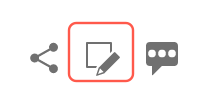

# Guia do colaborador para a documentação da Adobe

Este guia descreve como você pode contribuir com a ajuda da Adobe Enterprise na Experience League.

## O que é a documentação colaborativa?

A documentação técnica e o conteúdo de capacitação da Adobe Experience Cloud e de outros produtos da Adobe Enterprise são baseados em princípios de código aberto que usam as soluções GitHub, Markdown e Adobe Experience Cloud.

Este modelo de código aberto melhora a qualidade do conteúdo e a comunicação entre clientes, equipes de documentação e equipes de produtos. Em todas as páginas, agora você pode classificar a utilidade do conteúdo, registrar problemas e até mesmo contribuir com sugestões de conteúdo como solicitações de Git (PRs). As equipes de documentação da Adobe monitoram as contribuições e os problemas diariamente, além de fazerem atualizações e ajustes, conforme necessário.

## Trabalhar com a documentação colaborativa

Como usuário desse material, independentemente de você ser um funcionário, parceiro, cliente ou até mesmo um cliente potencial, você tem a opção de contribuir para essa documentação de várias maneiras simples.

* Avalie a utilidade da página ❶ e escreva um comentário opcional ❷
* Relatar um problema em uma página específica (requer logon do Git) ❸
* Enviar uma edição rápida para criar artigos inteiros, incluindo ativos e amostras de código (requer logon do Git) ❹

Essas opções são exibidas na parte inferior da página alguns segundos após sua abertura. Se descartar a área de feedback, você pode trazê-la de volta recarregando a página.

Este guia descreve tudo o que você precisa saber para interagir e contribuir com esse conjunto de materiais.

<!--
>[!IMPORTANT]
>All repositories that publish to docs.adobe.com have adopted the [Adobe Open Source Code of Conduct](../code-of-conduct.md) or the [.NET Foundation Code of Conduct](https://dotnetfoundation.org/code-of-conduct). For more information, see the [Contributing](../contributing.md) article.
>
> Minor corrections or clarifications to documentation and code examples in public repositories are covered by the [Adobe Documentation Terms of Use](https://www.adobe.com/legal/terms.html). New or significant changes generate a comment in the pull request, asking you to submit an online Contribution License Agreement (CLA) if you are not an employee of Adobe. We need you to complete the online form before we can review or accept your pull request.
-->

## Avalie a utilidade da página e escreva um comentário

Alguns segundos após abrir uma página, uma área de feedback é exibida na parte inferior da página. Clique no botão de like ou de dislike para indicar se a página foi útil.

Fique a vontade para deixar um comentário para fornecer um feedback adicional.

## Faça edições rápidas nos documentos existentes

Se você quiser fornecer um feedback mais detalhado, fazer edições rápidas é uma boa maneira de corrigir pequenos erros e omissões nos documentos. Ao sugerir uma edição, você envia uma solicitação de pull (PR) para nos enviar a correção/sugestão. Nós então poderemos vetar, aprovar e publicar a sugestão.

1. Assine o [Contrato de licença de colaborador (CLA)](http://opensource.adobe.com/cla.html) se for aceitável.

   É necessário enviar somente um CLA da Adobe uma vez.

1. Na área de feedback exibida na parte inferior do artigo, clique em **[!UICONTROL Detailed feedback options]** e então clique em **[!UICONTROL Suggest an edit]** para acessar o arquivo de origem do Markdown no GitHub.

   

1. Clique no ícone de lápis para editar o artigo.

   >[!NOTE]
   >
   >Se o ícone de lápis estiver esmaecido, será necessário fazer logon na sua conta GitHub ou criar uma nova conta.

   

1. Faça as alterações no editor da web.

   Você pode clicar na guia **[!UICONTROL Preview changes]** (Visualizar alterações) para verificar a formatação da alteração.

1. Depois de fazer as alterações, navegue até a parte inferior da página.

   Insira um título e uma descrição para a sua solicitação de pull e clique em **[!UICONTROL Propose file change]**, conforme mostrado na figura a seguir:

   

   >[!NOTE]
   >
   >Se você receber uma mensagem de erro de validação sobre a assinatura de um Contrato de Licença de Colaborador (CLA), clique em **[!UICONTROL Details]** para abrir o contrato de licença. Assine o contrato, se for aceitável. Em seguida, feche e abra a solicitação de extração e prossiga.

Isso é tudo. Os membros da equipe de documentação analisarão e mesclarão sua solicitação de pull. Obrigado!

## Relatar um problema

Outra maneira fácil de nos informar sobre um problema de conteúdo é usar a opção **[!UICONTROL Report an issue]**.

1. Na área de feedback exibida na parte inferior do artigo, clique em **[!UICONTROL Detailed feedback options]** e então clique em **[!UICONTROL Report an issue]** para acessar o arquivo de origem do Markdown no GitHub.

   

   >[!NOTE]
   >
   >Para relatar um problema, você precisa fazer logon na sua conta do GitHub ou criar uma conta.

   Clicar neste link permitirá registrar uma solicitação rápida na Experience League, usando a interface do GitHub Issue.

   O URL da página com o problema será preenchido automaticamente no campo de descrição.

1. Preencha o título, escreva uma breve descrição do problema e clique em *Submit new issue* (Enviar novo problema).

   

Enviar um problema notifica a equipe de conteúdo desta página, que poderá resolver o problema. Quando atualizarmos o conteúdo, você será informado na interface do GitHub Issues e notificado por e-mail quando o problema for atualizado ou encerrado.

## Compreender as permissões do GitHub

A interface de edição do GitHub se adapta às suas permissões de repositório. As imagens acima são precisas para os colaboradores que não têm permissões de gravação no repositório de destino. O GitHub cria automaticamente uma bifurcação do repositório de destino na sua conta. Se você tiver acesso de gravação no repositório de destino, o GitHub criará uma nova ramificação nele.

A Adobe usa solicitações de pull para todas as alterações, mesmo para colaboradores com acesso de gravação. A maioria dos repositórios protegem a ramificação `main` para que as atualizações sejam enviadas como solicitações de pull.

A experiência de edição no navegador é melhor para pequenas alterações ou alterações pouco frequentes. Se você fizer grandes contribuições ou usar recursos avançados do Git, recomendamos [bifurcar o repositório e trabalhar localmente](setup/full-workflow.md).

## Fornecer feedback

Com um conjunto de soluções tão grande quanto o da Adobe, a documentação está sempre em progresso. Se você detectar erros, registre um problema. Caso tenha sugestões sobre o material, informe-nos. Diga-nos quais informações você estava procurando. Informe-nos se você não conseguiu encontrar o que precisava. Caso tenha dificuldade para concluir sua tarefa, diga-nos como podemos ajudá-lo a aprender sobre nossas soluções.

A equipe de Documentação colaborativa agradece a todos os autores e produtores de conteúdo da Experience League.
