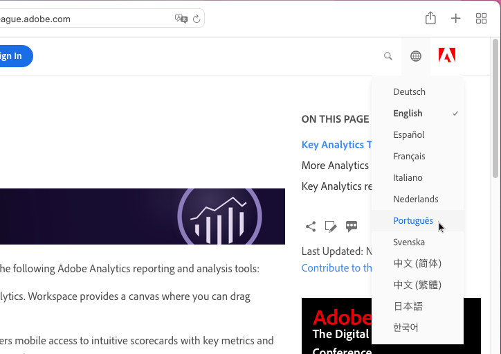
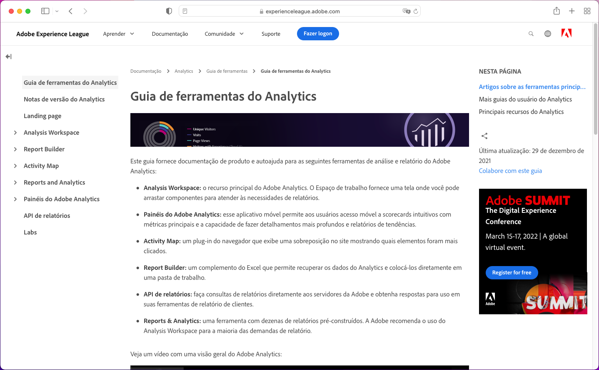
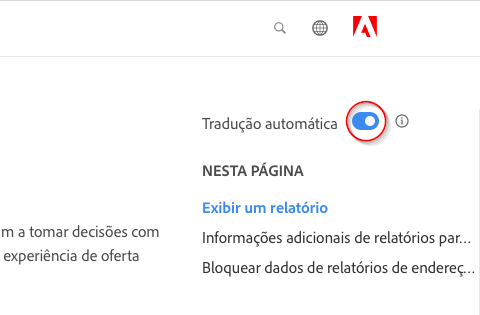
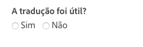

# Suporte de idioma para a documentação do produto Adobe Experience Cloud

A Adobe reconhece que você precisa de documentação do produto, ajuda e conteúdo de suporte disponíveis nos idiomas suportados pelos produtos da Adobe. Portanto, a Adobe oferece uma experiência de tradução exclusiva que permite a você selecionar o idioma de sua escolha e fornecer feedback sobre a qualidade do conteúdo traduzido.

## Selecione um idioma

Você pode visualizar a documentação do produto Adobe Experience Cloud na maioria dos idiomas.

1. Navegue até a [documentação do produto](https://helpx.adobe.com/br/support/experience-cloud.html) da Experience Cloud.

1. Navegue para localizar uma página de ajuda (por exemplo, [Analytics](https://docs.adobe.com/content/help/pt-BR/analytics/landing/home.html)).

1. Clique no Seletor de idioma (ícone do mundo) e escolha um idioma.

   

   A página é exibida no idioma selecionado.

   

   Nos casos em que a versão no seu idioma ainda não está disponível, a Adobe pode traduzir automaticamente o conteúdo. O serviço de tradução automática da Adobe exibe uma mensagem na parte superior da página em um campo azul:

   

   O conteúdo pode ser renderizado no seu idioma automaticamente ou você pode clicar em um link para acionar a tradução. (Esse cenário pode ocorrer ao clicar no hiperlink para retornar à fonte em inglês da página traduzida. Isso oferece a opção de visualizar a página traduzida sob demanda.) Você pode retornar ao original em inglês a qualquer momento.

   Ocasionalmente, o conteúdo original em inglês pode ter sido atualizado e publicado recentemente antes da conclusão das traduções. Ao clicar no seu idioma no menu suspenso, você verá uma notificação, na barra horizontal azul claro na parte superior da página, informando que a página foi traduzida automaticamente utilizando a versão anterior, com conteúdo atualizado que estará disponível em breve. Você terá a opção de visualizar o conteúdo original em inglês em uma nova janela do navegador, se preferir.

## Por que usar a tradução automática

A Adobe aproveita os recursos de tradução automática para publicar o conteúdo de suporte ao produto em vários idiomas o mais próximo possível do período de criação do conteúdo. Como o conteúdo de suporte é fundamental para o uso do produto, priorizamos a tradução de conteúdo por profissionais qualificados, mas também podemos optar pela tradução automática, pois a velocidade e a urgência são mais importantes.

A tradução automática é onipresente na Internet e seu uso geralmente é aceito como uma ferramenta avançada de coleta de informações. Esse recurso foi amplamente adotado para o conteúdo da base de conhecimento, em que pode haver pouca ou nenhuma intervenção humana. Apesar dos grandes avanços tecnológicos nos últimos anos, as traduções geradas automaticamente podem conter imprecisões e erros ocasionais de idioma e significado.

### Tradução automática pelo navegador

Se você definiu as preferências do navegador para traduzir automaticamente qualquer página para o seu idioma, lembre-se de que as traduções resultantes serão diferentes das obtidas na página da Adobe. Isso ocorre porque o serviço oferecido pelo navegador pode utilizar traduções padrão, enquanto as traduções da Adobe serão personalizadas para aderir às diretrizes e à terminologia de estilo da Adobe. Para obter ótimos resultados de tradução automática, recomendamos que você desative a opção do navegador para este site específico nas preferências do navegador ou clique em **Nunca traduzir** quando for exibido.

### Problemas conhecidos

Ocasionalmente, você pode ter problemas com os resultados da tradução automática, como traduções incompletas, caracteres corrompidos ou problemas de layout da página. Isso é causado por qualquer uma das várias ferramentas de tecnologia de criação, publicação ou tradução utilizadas pela Adobe. Faremos todos os esforços para listar os problemas conhecidos aqui
abaixo.

| **ID DO PROBLEMA** | **DESCRIÇÃO** | **STATUS** |
|--------------|-------------------------------------------------------------------------------------|------------|
| G11N3558 | Algumas páginas do Audience Manager são metade em inglês e metade traduzidas (francês e espanhol). | ABRIR |

### Feedback

Sempre que o conteúdo é traduzido automaticamente, por padrão ou por ação do usuário, existe a opção de enviar feedback à Adobe sobre as traduções. Na barra
horizontal azul clara na parte superior da página, você pode responder "Sim" ou "Não" à pergunta "Esta tradução foi útil?". A Adobe coleta essa métrica
valiosa e analisa os dados compilados para tomar decisões sobre a tradução do conteúdo. Seus comentários são importantes e recomendamos que você responda.

No futuro, planejamos permitir que você forneça comentários mais abrangentes, como registrar um problema, fazer melhorias sugeridas e até
solicitar mais idiomas. Alguns desses recursos já estão disponíveis nas páginas em inglês. Em longo prazo, acreditamos que isso ajudará a Adobe a melhorar a experiência
do usuário nessas páginas.

### Isenção de responsabilidade da tradução

A Adobe usa um programa de tradução automática para traduzir o texto para vários idiomas diferentes. Esteja ciente de que as traduções computadorizadas são traduções literais e podem conter erros. A Adobe não garante a precisão, a confiabilidade ou a atualidade das traduções fornecidas. A Adobe não será responsável por quaisquer perdas ou danos incorridos devido à confiança na precisão ou confiabilidade das informações traduzidas. Se houver diferenças entre o inglês e outro idioma, a versão em inglês é a que vale.

Se você quiser relatar um erro de tradução ou uma imprecisão, recomendamos que entre em contato conosco.
