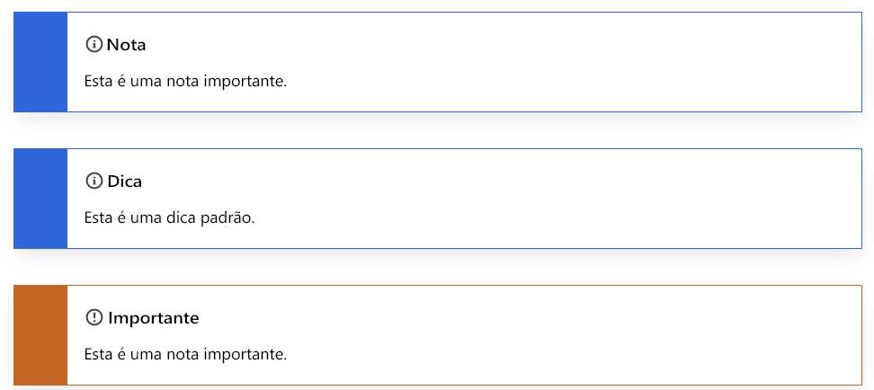

# Como usar o Markdown para escrever a documentação técnica

Os artigos técnicos da Adobe são escritos em uma linguagem de marcação simples chamada [Markdown](https://daringfireball.net/projects/markdown/), que facilita a leitura e o aprendizado.

Como estamos armazenando o conteúdo dos documentos da Adobe no GitHub, uma versão do Markdown chamada [GitHub Flavored Markdown (GFM)](https://help.github.com/categories/writing-on-github/) pode ser usada, a qual oferece funcionalidade adicional para as necessidades comuns de formatação. Além disso, a Adobe estendeu o Markdown de algumas maneiras para oferecer suporte a determinados recursos relacionados a ajuda, como notas, dicas e vídeos incorporados.

## Noções básicas sobre o Markdown

As seções a seguir descrevem as noções básicas de criação no Markdown.

### Cabeçalhos

Para criar um cabeçalho, use uma marca de hash (#) no início de uma linha:

```
# This is level 1 (article title)
## This is level 2
### This is level 3
#### This is level 4
##### This is level 5
```

### Texto básico

Um parágrafo não requer sintaxe especial no Markdown.

Para formatar o texto como **negrito**, coloque-o entre dois asteriscos. Para formatar o texto como *itálico*, coloque-o entre um único asterisco:

```markdown
   This text is **bold**.
   This text is *italic*.
   This text is both ***bold and italic***.
```

Para ignorar os caracteres de formatação do Markdown, use \ antes do caractere:

```markdown
This is not \*italicized\* type.
```

### Listas numeradas e listas de itens

Para criar listas numeradas, comece uma linha com `1.` ou `1)`, mas não use ambos os formatos dentro da mesma lista. Você não precisa especificar os números. O GitHub faz isso para você.

```markdown
1. This is step 1.
1. This is the next step.
1. This is yet another step, the third.
```

Exibido:

1. This is step 1.
1. This is the next step.
1. This is yet another step, the third.

Para criar listas de itens, comece uma linha com \* ou - ou +, mas não misture os formatos em uma mesma lista. (Não misture formatos de marcadores, como \* e \+, dentro do mesmo documento.)

```markdown
* First item in an unordered list.
* Another item.
* Here we go again.
```

Exibido:

* First item in an unordered list.
* Another item.
* Aqui vamos nós de novo.

Também é possível incorporar listas em listas e adicionar conteúdo entre itens de lista.

```markdown
1. Set up your table and code blocks.
1. Perform this step.

   

1. Make sure that your table looks like this: 

   | Hello | World |
   |---|---|
   | How | are you? |  

1. This is the fourth step.

   >[!NOTE]
   >
   >This is note text.

1. Do another step.
```

Exibido:

1. Set up your table and code blocks.
1. Perform this step.

   

1. Make sure that your table looks like this:

   | Hello | World |
   |---|---|
   | How | are you? |

1. This is the fourth step.

   >[!NOTE]
   >
   >Isto é um texto de nota.

1. Do another step.

### Tabela

As tabelas não fazem parte da especificação principal do Markdown, mas a Adobe oferece suporte a elas até certo ponto. O Markdown não é compatível com listas de várias linhas em células. A prática recomendada é evitar o uso de várias linhas em tabelas. É possível criar tabelas usando a barra vertical (|) para definir colunas e linhas. Os hifens criam o cabeçalho de cada coluna, enquanto que as barras separam cada coluna. Inclua uma linha em branco antes da tabela para que ela seja renderizada corretamente.

```markdown
| Header | Another header | Yet another header |
|--- |--- |--- |
| row 1 | column 2 | column 3 |
| row 2 | row 2 column 2 | row 2 column 3 |
```

Exibido:

| Header | Another header | Yet another header |
|--- |--- |--- |
| row 1 | column 2 | column 3 |
| row 2 | row 2 column 2 | row 2 column 3 |

Tabelas simples funcionam adequadamente no Markdown. No entanto, as tabelas que incluem vários parágrafos ou listas dentro de uma célula são difíceis de trabalhar. Para tal conteúdo, recomendamos usar um formato diferente, como cabeçalhos e texto.

Para obter mais informações sobre como criar tabelas, consulte:

* [Como organizar informações com tabelas do GitHub](https://docs.github.com/pt/github/writing-on-github/organizing-information-with-tables)
* O aplicativo web [Gerador de tabelas para Markdown](https://www.tablesgenerator.com/markdown_tables)
* [Converter tabelas HTML para Markdown](https://jmalarcon.github.io/markdowntables/)

### Links

A sintaxe do Markdown para um link em linha consiste na parte `[link text]`, que é o texto que será aplicado ao hiperlink, seguida pela parte `(file-name.md)`, que é o URL ou o nome do arquivo ao qual está sendo vinculado:

`[link text](file-name.md)`

```markdown
[Adobe](https://www.adobe.com)
```

Exibido:

[Adobe](https://www.adobe.com)

Para links para artigos (referências cruzadas) no repositório, use links relativos. Você pode usar todos os operandos de links relativos, como ./ (diretório atual), ../ (voltar um diretório) e ../../ (voltar dois diretórios).

```markdown
See [Overview example article](../../overview.md)
```

Para obter mais informações sobre links, consulte o artigo [Links](linking.md) deste guia para obter a sintaxe do link.

### Imagens

```markdown

```

Exibido:


### Blocos de código

O Markdown oferece suporte à adição em linha de blocos de código em uma sentença e como um bloco “cercado” separado entre sentenças. Para obter detalhes, consulte o [suporte nativo do Markdown para blocos de código.](https://daringfireball.net/projects/markdown/syntax#precode)

Use acentos graves (`` ` ``) para criar estilos de código em linha em um parágrafo. Para criar um bloco de código de várias linhas específico, adicione três acentos graves (` ` `` `) antes e depois do bloco de código (chamado de “bloco de código cercado” no Markdown e apenas componente de “bloco de código” no AEM). Para blocos de código cercados, adicione o texto do código depois do primeiro conjunto de acentos graves para que o Markdown aponte a sintaxe de código correta. Exemplo: ` `` `javascript`

Exemplos:

```markdown
This is `inline code` within a paragraph of text.
```

Exibido:

This is `inline code` within a paragraph of text.

Isso é um bloco de código cercado:

```javascript
function test() {
 console.log("notice the blank line before this function?");
```

## Extensões personalizadas do Markdown

Os artigos da Adobe usam o Markdown padrão para a maioria das formatações, como parágrafos, links, listas e cabeçalhos. Para obter uma formatação mais avançada, os artigos podem usar recursos estendidos do Markdown, como:

* Blocos de notas
* Vídeos incorporados
* Tags de tradução
* Propriedades de componente, como atribuir uma ID de cabeçalho diferente a um cabeçalho e especificar um tamanho da imagem

Use a aspa de bloco ( > ) do Markdown no início de cada linha para unir um componente estendido, como uma nota.

Alguns elementos comuns do Markdown, como cabeçalhos e blocos de código, incluem propriedades estendidas. Se você precisar alterar as propriedades padrão, adicione os parâmetros em chaves francesas /{ /} depois do componente. As propriedades estendidas estão descritas em contexto.

### Blocos de notas

É possível escolher entre esses tipos de blocos de notas a fim de chamar a atenção para um conteúdo específico:

* `[!NOTE]`
* `[!TIP]`
* `[!IMPORTANT]`
* `[!CAUTION]`
* `[!WARNING]`
* `[!ADMINISTRATION]`
* `[!AVAILABILITY]`
* `[!PREREQUISITES]`
* `[!ERROR]`
* `[!ADMINISTRATION]`
* `[!INFO]`
* `[!SUCCESS]`

Em geral, os blocos de notas devem ser usados com moderação, pois podem causar problemas. Embora também sejam compatíveis com blocos de código, imagens, listas e links, tente manter os blocos de notas simples e diretos.


```markdown
>[!NOTE]
>
>This is a standard NOTE block.
```

```markdown
>[!TIP]
>
>This is a standard TIP.
```

```markdown
>[!IMPORTANT]
>
>This is an IMPORTANT note.
```

Exibido:



### Vídeos

Os vídeos incorporados não serão renderizados nativamente no Markdown, mas você poderá usar essa extensão do Markdown.

```markdown
>[!VIDEO](https://video.tv.adobe.com/v/29770/?quality=12)
```

Exibido:

>[!VIDEO](https://video.tv.adobe.com/v/29770/?quality=12)

### Mais artigos como este

O componente “Mais artigos como este” no AEM aparece no fim de um artigo. Ele exibe links relacionados. Quando o artigo é renderizado, ele pode ser formatado como um cabeçalho de nível 2 (##) sem ser adicionado ao mini-TOC.


Exibido:

>[!MORELIKETHIS]
>* [Artigo 1](https://helpx.adobe.com/br/support/analytics.html)
>* [Artigo 2](https://helpx.adobe.com/br/support/audience-manager.html)


### UICONTROL e DNL

Todo o conteúdo de ajuda do Markdown é localizado usando a tradução automática inicialmente. Se a ajuda nunca foi localizada, mantemos a tradução automática. No entanto, se o conteúdo da ajuda tiver sido localizado no passado, o conteúdo traduzido por máquina atuará como um espaço reservado, enquanto o conteúdo estiver passando por tradução humana.

**``**

Durante a tradução automática, os itens marcados com `` são verificados em relação a um banco de dados de localização para que seja obtida a tradução apropriada. Caso a interface não esteja localizada, essa tag permitirá que o sistema deixe a referência da interface em inglês para esse idioma específico (ou seja, referências do Analytics em italiano).

**Exemplo:**

1. Acesse a tela **[!UICONTROL Run Process]**.
1. Escolha **[!UICONTROL File > Print > Print All]** para imprimir todos os arquivos no servidor.
1. A caixa de diálogo [!UICONTROL Processing Rules] é exibida.

**Fonte:**

```markdown
1. Go to the **[!UICONTROL Run Process]** screen.
1. Choose **[!UICONTROL File > Print > Print All]** to print all the files on your server.
1. The [!UICONTROL Processing Rules] dialog box appears.
```

>[!NOTE]
>Das três opções de marcação, essa é a mais importante para fornecer uma alta qualidade e é obrigatória.

**`[!DNL]`**

Como regra, usamos uma lista “Não traduzir” para informar aos mecanismos de tradução automática o que manter em inglês. Os itens mais comuns são os nomes longos de solução, como “Adobe Analytics”, “Adobe Campaign” e “Adobe Target”. No entanto, pode haver casos em que tenhamos de forçar o mecanismo a utilizar o inglês porque o termo em questão pode ser usado de forma específica ou geral. O caso mais óbvio seriam os nomes curtos de soluções, como “Analytics”, “Campaign”, “Target” etc. Seria difícil para uma máquina entender que esses são nomes de solução, não termos gerais. A tag também pode ser usada para nomes/recursos de terceiros que sempre permanecem em inglês ou para seções mais curtas de texto, como uma frase ou sentença que deve permanecer em inglês.

**Exemplo:**

* Com o [!DNL Target], você pode criar testes A/B para encontrar o ideal
* O Adobe Analytics é uma solução eficiente para fazer análises no seu site. O [!DNL Analytics] também pode ajudar você nos relatórios para assimilar facilmente esses dados.

**Fonte:**

```markdown
* With [!DNL Target], you can create A/B tests to find the optimal 
* Adobe Analytics is a powerful solution to collect analytics on your site. [!DNL Analytics] can also help you with reporting to easily digest that data.
```

## Identificar e solucionar problemas

### Texto alternativo

O texto alternativo que contém sublinhados não será renderizado corretamente. Por exemplo, em vez de usar isso:

```markdown

```

Nossa prática recomendada é usar hifens (-) em vez de sublinhados (_) nos nomes de arquivo.

```markdown

```

### Apóstrofos e aspas

Se você copiar o texto em um editor do Markdown, poderá conter apóstrofos ou aspas “inteligentes” (curvos). Eles precisam ser codificados ou alterados para apóstrofos ou aspas básicos. Caso contrário, você terá caracteres estranhos como este quando o arquivo for publicado: It’s

Estas são as codificações das versões “inteligentes” dessas marcas de pontuação:

* Aspas à esquerda (abertura): `“`
* Aspas à direita (fechamento): `”`
* Aspas simples (fechamento) ou apóstrofe: `’`
* Aspas simples (abertura) aspas simples (raramente usadas): `‘`

### Colchetes

Se você usar colchetes no texto (não código) no arquivo - por exemplo, para indicar um espaço reservado -, será necessário codificar os colchetes manualmente. Caso contrário, o Markdown os considerará tags HTML.

Por exemplo, codifique `<script name>` como `&lt;script name&gt;`

### “E” comercial em títulos

“E” comercial (&amp;) não é permitido em títulos. Use “e” ou a codificação `&amp;`.

## Consulte também

### Recursos do Markdown

* [Introdução ao Markdown](https://daringfireball.net/projects/markdown/syntax)
* [Fundamentos do Markdown do GitHub](https://docs.github.com/pt/github/writing-on-github/getting-started-with-writing-and-formatting-on-github)
